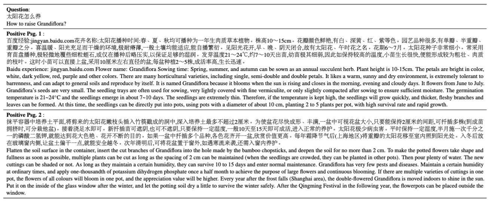

## DuReader-Retrieval

**DuReader-Retrieval** is a large-scale Chinese dataset for passage retrieval from web search engine. The dataset contains more than **90K** queries and over **8M** unique passages from realistic data
sources. DuReader-Retrieval has the following features:

- Less false negative samples in the evaluation set with extensive human annotation. 
- Nearly no test sample leaking caused by semantically similar questions between training and evaluation sets.
- Extra out-of-domain test sets for benchmarking the domain generalization capability.

A example from the dataset is shown below. For more details of the dataset, please refer to [our paper](http://arxiv.org/abs/2203.10232). 

## Download Dataset

Coming soon...

## Baseline System

The baseline system is based on [RocketQA](https://aclanthology.org/2021.naacl-main.466.pdf) and available in this [repository](https://github.com/PaddlePaddle/RocketQA/tree/main/research/DuReader-Retrieval-Baseline).

